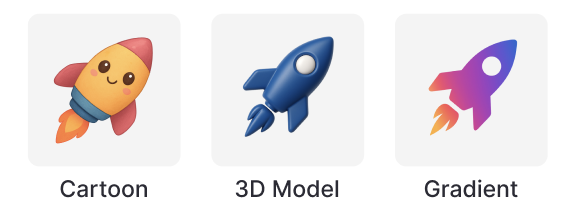

# AI Icon Generator

Generate professional icon sets using AI. Create 8 consistent, themed icons in multiple styles using OpenAI and Replicate Flux-Schnell.

🌐 **[Live Demo](https://icon-generator-ivory.vercel.app/)** - Try it now!



## ✨ Features

- **3 Icon Styles**: Cartoon, 3D Model, and Gradient
- **AI-Powered**: OpenAI GPT-4o-mini + Replicate Flux-Schnell
- **Professional Quality**: 512×512 PNG format
- **Consistent Sets**: 8 thematically related icons per request
- **Type-Safe**: Built with Next.js 15 + TypeScript

## 🚀 Quick Start

```bash
# Clone and install
git clone <repository-url>
cd icon-generator
pnpm install

# Set up environment variables
# Create .env file with:
# OPENAI_API_KEY=your_openai_api_key
# REPLICATE_API_TOKEN=your_replicate_api_token

# Run
pnpm dev
```

Open [http://localhost:3000](http://localhost:3000) and start generating!

## 📖 Usage

1. Enter a prompt (e.g., "office supplies")
2. Choose a style
3. Generate your 8-icon set
4. Download individual icons

### Styles

- **Cartoon**: Cute kawaii-style icons in bright orange and golden yellow colors
- **3D Model**: Photorealistic 3D rendered icons in deep navy blue
- **Gradient**: Modern vector icons with linear gradients from orange to pink to purple

## 🛠️ Tech Stack

- **Framework**: Next.js 15 with App Router
- **UI**: @gmzh/react-ui + Tailwind CSS + TanStack Query
- **AI**: OpenAI GPT-4o-mini + Replicate Flux-Schnell
- **Language**: TypeScript
- **Testing**: Jest + Testing Library

## 📚 API

**POST** `/api/generate-icons`

```typescript
// Request
{
  prompt: string;    // 2-30 characters
  style: "Cartoon" | "ThreeDModel" | "Gradient";
}

// Response
{
  success: boolean;
  images: GeneratedIcon[];
  metadata: { originalPrompt: string; style: string; generatedItems: string[]; };
}
```

## 💰 Cost

~$0.024 per 8-icon set ($0.003 per image + OpenAI costs)

## 🤝 Development

```bash
pnpm test        # Run all tests
pnpm test:watch  # Run tests in watch mode
pnpm test:coverage # Run tests with coverage report
pnpm lint        # Lint code
pnpm build       # Build for production
```


## 🏗️ Architecture

The application is built with a clean, maintainable architecture:

- **Frontend**: React components with server-side state management
- **API Layer**: Next.js API routes with proper error handling
- **AI Integration**: OpenAI for prompt enhancement + Replicate for image generation
- **Type Safety**: Comprehensive TypeScript definitions throughout
- **Testing**: Jest + React Testing Library for reliability

## 🚀 Deployment

The application is deployed on Vercel and configured for production use:

- **Live Demo**: [icon-generator-f7n02c47s-melodys-projects-b4357c60.vercel.app](https://icon-generator-f7n02c47s-melodys-projects-b4357c60.vercel.app/)
- **Performance**: Optimized with Next.js App Router
- **Monitoring**: Comprehensive logging with Winston
- **Error Handling**: Graceful fallbacks and user feedback


## 🔮 Potential Improvements

- [ ] **Custom Colors**: Allow users to specify color palettes
- [ ] **Additional Styles**: Add Minimal, Isometric, or Hand-drawn styles  
- [ ] **Export Formats**: Support SVG and JPG formats
- [ ] **Bulk Download**: ZIP download for entire icon sets
- [ ] **Caching**: Reduce API costs with intelligent caching
- [ ] **AI Orchestration**: Smart coordination between OpenAI and Replicate services
- [ ] **Better Testing**: Improve test coverage from 16% to 70%+
- [ ] **E2E Testing**: More testing coverage and End-to-end testing 

## 🤝 Contributing

Contributions welcome! Help needed with testing, new styles, and performance optimization.

